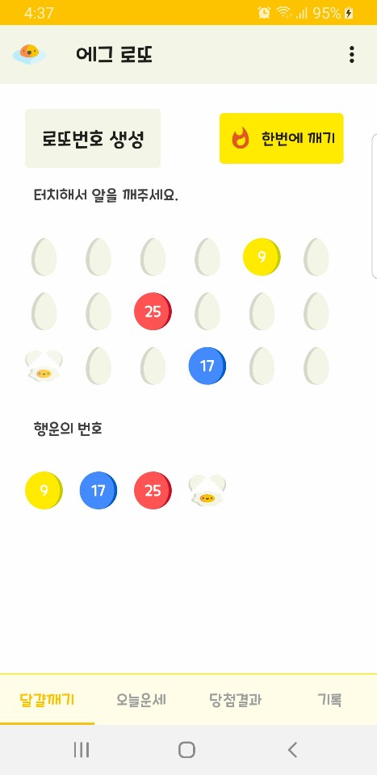

# 에그 로또 (Egg Lotto)
Android 5.0 버전 이상을 지원합니다. (Lollipop version, SDK >= 21)

달걀을 터치하여 깨면, 로또 번호가 나오는 엔터테인먼트 애플리케이션입니다. 
달걀을 깨는 애니메이션과 사운드를 구현하였으며, 오픈소스 라이브러리를 사용하여 여러 편의 기능을 제공합니다. 
QR 코드 인식기, 주간 당첨발표시간 알림 및 오늘의 운세를 제공합니다.

## Features
### 1. Lotto Number Generation
* 달걀을 터치하면 달걀이 깨지며 로또 번호를 생성합니다.
 
</img> 
</img>
### 2. Save selected number
* Room을 사용하여 선택한 번호를 데이터베이스에 저장합니다.
3. QR code recognizer
* Zxing 라이브러리를 사용하여 QR 코드 인식기를 구현합니다.
4. Winning time reminder
* AlarmManager를 사용하여 당첨 발표 시간 주간 알림을 구현합니다. 
5. Today's horoscope
* Retrofit2 라이브러리를 사용하여 오늘의 운세를 가져옵니다.
6. Check the winning result
* WebView를 사용하여 회차별 당첨번호 웹페이지를 표시합니다.
7. Animations
* 달걀이 깨지는 애니메이션과 깨지는 소리를 재생합니다.

## Dependencies
1. [Glide](https://github.com/bumptech/glide)
2. [Retrofit2](https://square.github.io/retrofit/)
3. [Timber](https://github.com/JakeWharton/timber)
4. [Zxing](https://github.com/journeyapps/zxing-android-embedded)

## Playstore
[Egg Lotto](https://play.google.com/store/apps/details?id=com.duke.xial.elliot.kim.kotlin.egglotto)
